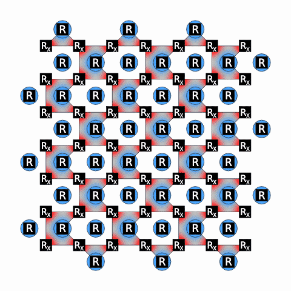

# Dynamic Detection Regions

Stim's exact detector-slice diagrams, moving continuously between ticks.



*Distance-7 rotated surface-code X-memory demo.*

## Use it

Open the notebook from this folder, or use it directly with a `stim.Circuit`
named `circuit`:

```python
from dynamic_detection_regions import dynamic_detection_regions

dynamic_detection_regions(circuit)
```

The result displays directly in a local VS Code or Jupyter notebook, starts
playing immediately, and loops. Nothing is written to disk. Saving a portable
HTML file is optional:

```python
animation = dynamic_detection_regions(circuit)
animation.save("animation.html")
```

Click **Save GIF** in the player to render and download a compact looping GIF
entirely in memory, without saving HTML or temporary frames.

For a smaller part of a large circuit, use Stim's half-open tick-range style:

```python
dynamic_detection_regions(circuit, tick=range(20, 41))
```

An integer selects one exact native diagram frame. When detector or observable
filters are given without `tick`, the animation automatically spans from one
frame before the earliest selected region appears through one frame after the
latest selected region disappears:

```python
dynamic_detection_regions(circuit, filter_coords=["D3", "D17"])
```

An explicit `tick` always overrides this automatic range. Autoplay and looping
can also be disabled:

```python
dynamic_detection_regions(circuit, autoplay=False, loop=False)
```

